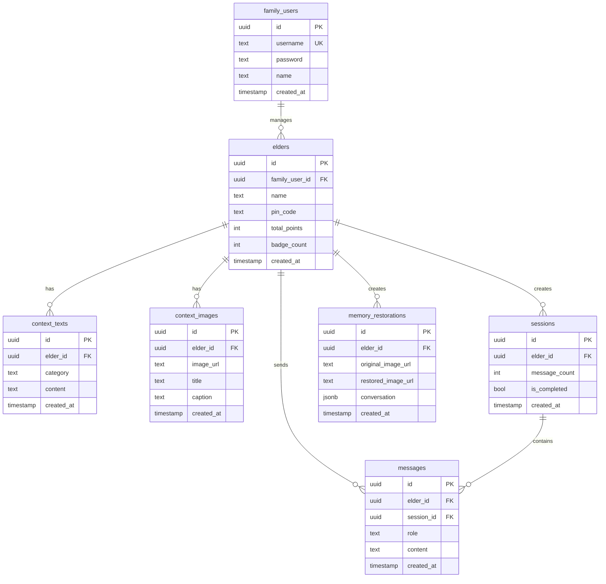
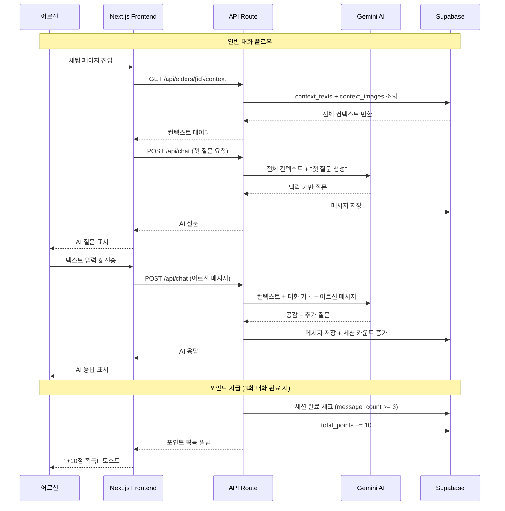
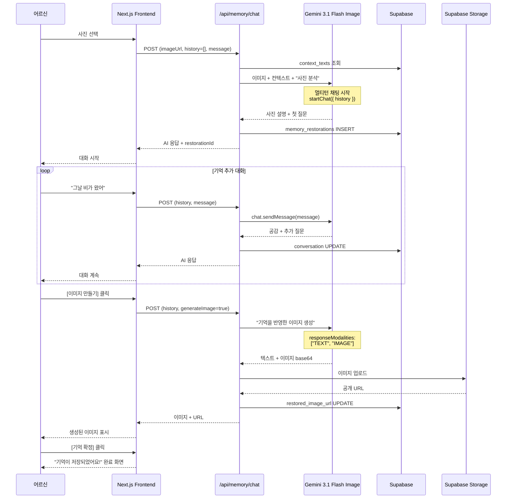
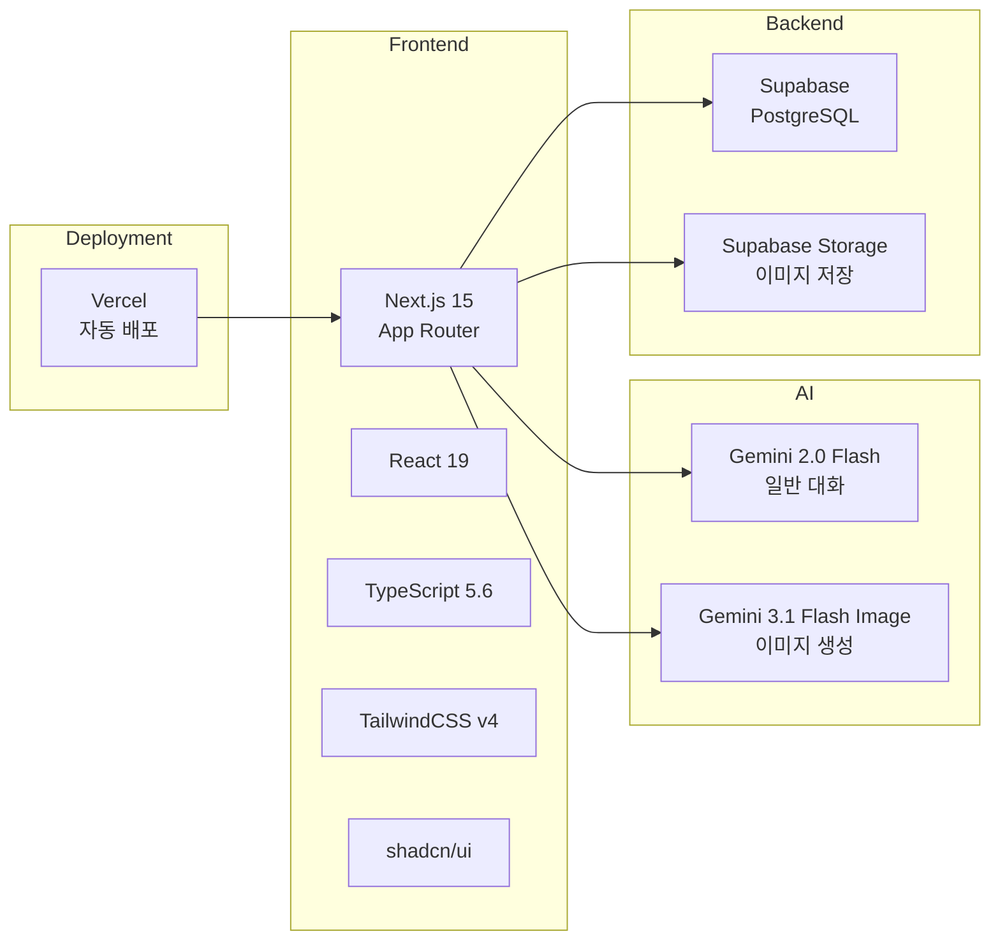

# 🧵 Memory Thread

> **어르신의 기억을 되살리는 AI 말벗 서비스**  
> 가족이 입력한 인생 맥락을 AI가 통째로 기억하고, 먼저 말을 건네며 기억과 감정을 자극하는 비의료적 인지 자극 플랫폼

<br/>

## 📖 서비스 소개

Memory Thread는 고령 어르신을 위한 AI 기반 대화형 기억 복원 서비스입니다. 단순한 챗봇이 아닌, **가족이 등록한 어르신의 인생 맥락(고향, 가족, 직업, 취미, 추억, 건강)과 가족 사진을 AI가 모두 기억**하고, 이를 바탕으로 어르신에게 먼저 질문을 건네며 자연스러운 대화를 이끌어냅니다.

### 🎯 핵심 가치

1. **맥락 기반 대화**: Gemini 1.5 Pro의 1M 토큰 컨텍스트 윈도우를 활용해 RAG 없이 어르신의 인생 전체를 이해
2. **AI 주도 대화**: 어르신이 먼저 말하지 않아도 AI가 맥락 기반으로 질문을 시작
3. **기억 이미지 복원**: 가족 사진과 대화 내용을 결합해 Gemini 3.1 Flash Image로 새로운 기억 이미지 생성
4. **간편한 접근성**: 스마트폰에 익숙하지 않은 어르신을 위한 4자리 PIN 로그인과 큰 글씨 UI
5. **게이미피케이션**: 대화 3회마다 포인트 지급, 뱃지 획득으로 지속적 참여 동기 부여

### 🌟 주요 기능

#### 👵 어르신 기능
- **AI 기억 대화**: AI가 먼저 질문을 건네며 자연스러운 대화 시작
- **기억 이미지 복원**: 가족 사진을 보며 대화 → AI가 기억을 반영한 새 이미지 생성
- **음성 대화**: 텍스트 입력 대신 음성으로 편하게 대화 (STT/TTS)
- **포인트 & 뱃지**: 대화 3회마다 +10점, 100점마다 뱃지 획득

#### 👨‍👩‍👧 가족 기능
- **어르신 등록**: 이름과 4자리 PIN으로 간편 등록
- **텍스트 컨텍스트 관리**: 고향/가족/직업/취미/추억/건강 6가지 카테고리 정보 입력
- **이미지 컨텍스트 관리**: 가족 사진 업로드 및 캡션 등록
- **로그인 설정**: 어르신 PIN 변경 관리

<br/>

## 🏗️ 기술 아키텍처

### 시스템 구조도

```mermaid
graph TB
    subgraph "Frontend - Next.js 15"
        A[홈 페이지]
        B[어르신 로그인<br/>4자리 PIN]
        C[가족 로그인<br/>ID/PW]
        D[채팅 페이지<br/>AI 대화]
        E[기억복원 페이지<br/>이미지 생성]
        F[뱃지 페이지<br/>포인트/뱃지]
        G[관리 대시보드<br/>어르신 목록]
        H[어르신 관리<br/>컨텍스트 입력]
    end

    subgraph "API Routes"
        API1[/api/auth/elder<br/>PIN 인증]
        API2[/api/auth/family<br/>가족 로그인]
        API3[/api/chat<br/>AI 대화]
        API4[/api/memory/chat<br/>이미지 생성 대화]
        API5[/api/points<br/>포인트 지급]
        API6[/api/elders<br/>어르신 CRUD]
        API7[/api/elders/[id]/context<br/>컨텍스트 관리]
        API8[/api/elders/[id]/images<br/>이미지 관리]
    end

    subgraph "AI Services"
        GEMINI1[Gemini 2.0 Flash<br/>일반 대화]
        GEMINI2[Gemini 3.1 Flash Image<br/>이미지 생성 대화]
    end

    subgraph "Database - Supabase"
        DB1[(PostgreSQL)]
        DB2[Storage<br/>elder-images]
    end

    A --> B
    A --> C
    B --> API1
    C --> API2
    B --> D
    B --> E
    D --> F
    C --> G
    G --> H

    D --> API3
    E --> API4
    D --> API5
    H --> API6
    H --> API7
    H --> API8

    API3 --> GEMINI1
    API4 --> GEMINI2
    
    API1 --> DB1
    API2 --> DB1
    API3 --> DB1
    API4 --> DB1
    API5 --> DB1
    API6 --> DB1
    API7 --> DB1
    API8 --> DB1
    API8 --> DB2
    API4 --> DB2

    GEMINI1 --> DB1
    GEMINI2 --> DB1
```

### 데이터베이스 스키마



### AI 대화 플로우



### 기억 이미지 복원 플로우



### 기술 스택



<br/>

## 🚀 시작하기

### 환경 변수 설정

`.env.local` 파일을 생성하고 다음 변수를 설정하세요:

```bash
GEMINI_API_KEY=your_gemini_api_key
NEXT_PUBLIC_SUPABASE_URL=your_supabase_url
NEXT_PUBLIC_SUPABASE_ANON_KEY=your_supabase_anon_key
```

### 설치 및 실행

```bash
# 의존성 설치
npm install

# 개발 서버 실행
npm run dev
```

브라우저에서 [http://localhost:3000](http://localhost:3000)을 열어 확인하세요.

### 데이터베이스 초기화

Supabase에서 다음 테이블을 생성하세요:

```sql
-- 가족 계정 (하드코딩)
CREATE TABLE family_users (
  id UUID DEFAULT gen_random_uuid() PRIMARY KEY,
  username TEXT UNIQUE NOT NULL,
  password TEXT NOT NULL,
  name TEXT NOT NULL,
  created_at TIMESTAMP DEFAULT NOW()
);

-- 어르신 프로필
CREATE TABLE elders (
  id UUID DEFAULT gen_random_uuid() PRIMARY KEY,
  family_user_id UUID REFERENCES family_users(id) ON DELETE CASCADE,
  name TEXT NOT NULL,
  pin_code TEXT NOT NULL,
  total_points INTEGER DEFAULT 0,
  badge_count INTEGER DEFAULT 0,
  created_at TIMESTAMP DEFAULT NOW()
);

-- 텍스트 컨텍스트 (6카테고리)
CREATE TABLE context_texts (
  id UUID DEFAULT gen_random_uuid() PRIMARY KEY,
  elder_id UUID REFERENCES elders(id) ON DELETE CASCADE,
  category TEXT NOT NULL,
  content TEXT NOT NULL,
  created_at TIMESTAMP DEFAULT NOW()
);

-- 이미지 컨텍스트
CREATE TABLE context_images (
  id UUID DEFAULT gen_random_uuid() PRIMARY KEY,
  elder_id UUID REFERENCES elders(id) ON DELETE CASCADE,
  image_url TEXT NOT NULL,
  title TEXT,
  caption TEXT,
  created_at TIMESTAMP DEFAULT NOW()
);

-- 대화 세션
CREATE TABLE sessions (
  id UUID DEFAULT gen_random_uuid() PRIMARY KEY,
  elder_id UUID REFERENCES elders(id) ON DELETE CASCADE,
  message_count INTEGER DEFAULT 0,
  is_completed BOOLEAN DEFAULT FALSE,
  created_at TIMESTAMP DEFAULT NOW()
);

-- 대화 메시지
CREATE TABLE messages (
  id UUID DEFAULT gen_random_uuid() PRIMARY KEY,
  elder_id UUID REFERENCES elders(id) ON DELETE CASCADE,
  session_id UUID REFERENCES sessions(id) ON DELETE CASCADE,
  role TEXT NOT NULL,
  content TEXT NOT NULL,
  created_at TIMESTAMP DEFAULT NOW()
);

-- 기억 복원 기록
CREATE TABLE memory_restorations (
  id UUID DEFAULT gen_random_uuid() PRIMARY KEY,
  elder_id UUID REFERENCES elders(id) ON DELETE CASCADE,
  original_image_url TEXT NOT NULL,
  restored_image_url TEXT,
  conversation JSONB DEFAULT '[]',
  created_at TIMESTAMP DEFAULT NOW()
);
```

Supabase Storage에서 `elder-images` 버킷을 생성하고 공개 접근을 허용하세요.

<br/>

## 📱 사용자 플로우

### 어르신 여정

```
홈 페이지
  ↓ [어르신 로그인]
4자리 PIN 입력
  ↓
채팅 페이지 (AI가 먼저 질문)
  ↓ 3회 대화 완료
+10 포인트 획득
  ↓
뱃지 페이지 (100점마다 뱃지)
```

### 가족 여정

```
홈 페이지
  ↓ [가족 관리]
가족 로그인 (ID/PW)
  ↓
관리 대시보드
  ↓ [어르신 추가] or 카드 클릭
어르신 관리 페이지
  ├─ 탭1: 텍스트 컨텍스트 (6카테고리)
  ├─ 탭2: 이미지 관리 (사진 업로드)
  └─ 탭3: 로그인 설정 (PIN 변경)
```

### 기억 이미지 복원 여정

```
홈 → [기억복원] 카드
  ↓
PIN 로그인
  ↓
가족이 등록한 사진 그리드
  ↓ 사진 선택
AI가 사진 분석 + 첫 질문
  ↓
어르신이 기억 추가 대화
  ↓ [이미지 만들기]
AI가 기억 반영 이미지 생성
  ↓ [재생성] or [기억 확정]
기억 저장 완료
```

<br/>

## 🎨 주요 기술 특징

### 1. Gemini 1M Context Window 활용
- RAG 없이 어르신의 전체 인생 맥락을 한 번에 전달
- 텍스트 컨텍스트 6카테고리 + 이미지 컨텍스트 + 대화 기록을 모두 포함
- 일관성 있고 맥락 깊은 대화 생성

### 2. 멀티모달 AI 대화
- Gemini 3.1 Flash Image Preview의 `responseModalities: ["TEXT", "IMAGE"]` 활용
- 멀티턴 채팅으로 기억을 점진적으로 수집하며 이미지 생성
- 첫 요청에만 이미지 전송, 이후 자동으로 컨텍스트 유지

### 3. 어르신 친화적 UX
- 4자리 PIN 로그인 (큰 숫자 키패드)
- 큰 글씨, 고대비 UI
- AI가 먼저 질문을 건네는 방식 (어르신이 먼저 입력할 필요 없음)
- 음성 입력/출력 지원 (STT/TTS)

### 4. 게이미피케이션
- 대화 3회 완료 시 자동 +10점
- 100점마다 뱃지 획득
- 진행 상황 시각화로 지속적 참여 유도

<br/>

## 📂 프로젝트 구조

```
memory_thread/
├── app/
│   ├── api/                      # API Routes
│   │   ├── auth/                 # 인증 API
│   │   │   ├── elder/            # 어르신 PIN 로그인
│   │   │   └── family/           # 가족 로그인
│   │   ├── chat/                 # 일반 AI 대화
│   │   ├── memory/               # 기억 이미지 복원
│   │   │   └── chat/             # 이미지 생성 대화 API
│   │   ├── points/               # 포인트 지급
│   │   ├── elders/               # 어르신 CRUD
│   │   │   └── [elderId]/
│   │   │       ├── context/      # 텍스트 컨텍스트 관리
│   │   │       └── images/       # 이미지 컨텍스트 관리
│   │   └── messages/             # 메시지 조회
│   ├── elder/                    # 어르신 페이지
│   │   ├── login/                # PIN 로그인
│   │   ├── chat/                 # AI 대화
│   │   ├── memory/               # 기억 이미지 복원
│   │   └── badge/                # 포인트/뱃지
│   ├── family/                   # 가족 페이지
│   │   ├── login/                # 가족 로그인
│   │   ├── dashboard/            # 관리 대시보드
│   │   └── elders/[elderId]/    # 어르신 관리
│   ├── _components/              # 공통 컴포넌트
│   ├── _lib/                     # 유틸리티
│   │   ├── gemini.ts             # Gemini AI 클라이언트
│   │   ├── supabase.ts           # Supabase 클라이언트
│   │   └── session.ts            # 세션 관리
│   └── page.tsx                  # 홈 페이지
├── components/ui/                # shadcn/ui 컴포넌트
├── docs/                         # 프로젝트 문서
│   ├── PRD.md                    # 제품 요구사항 정의서
│   ├── PRD-image.md              # 기억 이미지 복원 PRD
│   └── hack-rule.md              # 해커톤 규칙
└── README.md
```

<br/>

## 🎯 핵심 API

### POST /api/chat
일반 AI 대화 API (Gemini 2.0 Flash)

**요청**:
```typescript
{
  elderId: string,
  message: string,
  sessionId?: string
}
```

**응답**:
```typescript
{
  reply: string,
  sessionId: string,
  pointsAwarded?: number
}
```

### POST /api/memory/chat
기억 이미지 복원 대화 API (Gemini 3.1 Flash Image)

**요청**:
```typescript
{
  elderId: string,
  imageUrl: string,
  history: ChatTurn[],
  message: string,
  generateImage: boolean,
  restorationId?: string
}
```

**응답**:
```typescript
{
  text: string,
  imageBase64?: string,
  imageMimeType?: string,
  restoredImageUrl?: string,
  restorationId: string
}
```

<br/>

## 🔧 기술 스택

| 카테고리 | 기술 | 버전 |
|---------|------|------|
| **프레임워크** | Next.js | 16.1.6 |
| **언어** | TypeScript | 5.6+ |
| **UI 라이브러리** | React | 19.2.3 |
| **스타일링** | TailwindCSS | v4 |
| **컴포넌트** | shadcn/ui | - |
| **AI 모델** | Gemini 2.0 Flash | - |
| **AI 모델** | Gemini 3.1 Flash Image | - |
| **데이터베이스** | Supabase (PostgreSQL) | - |
| **스토리지** | Supabase Storage | - |
| **배포** | Vercel | - |

<br/>

## 🏆 해커톤 정보

이 프로젝트는 **Google Gemini 해커톤**을 위해 개발되었습니다.

### 주제: 사회적 선을 위한 Gemini
AI를 활용해 모두를 위한 더 나은 사회적, 경제적, 문화적 결과를 만들기 위한 프로젝트입니다.

### 핵심 차별점
- ❌ 기본 RAG 애플리케이션이 아님
- ✅ Gemini의 1M 컨텍스트 윈도우를 활용한 전체 맥락 이해
- ✅ 멀티모달 AI (텍스트 + 이미지) 활용
- ✅ AI 주도 대화 (어르신이 먼저 입력하지 않아도 됨)
- ✅ 실시간 이미지 생성 및 반복 개선 루프

<br/>

## 📝 라이선스

이 프로젝트는 해커톤용으로 개발되었습니다.

---

<br/><br/>

# 🧵 Memory Thread

> **AI-Powered Memory Companion for Elderly Care**  
> A non-medical cognitive stimulation platform that remembers entire life contexts and proactively engages seniors in meaningful conversations

<br/>

## 📖 Service Overview

Memory Thread is an AI-based conversational memory restoration service for elderly users. Unlike simple chatbots, **the AI remembers all life contexts (hometown, family, career, hobbies, memories, health) and family photos registered by family members**, and proactively initiates conversations based on this understanding.

### 🎯 Core Values

1. **Context-Aware Conversations**: Leverages Gemini 1.5 Pro's 1M token context window to understand entire life stories without RAG
2. **AI-Initiated Dialogue**: AI starts conversations proactively, so seniors don't need to type first
3. **Memory Image Restoration**: Combines family photos with conversation content to generate new memory images using Gemini 3.1 Flash Image
4. **Easy Accessibility**: 4-digit PIN login and large-text UI for seniors unfamiliar with smartphones
5. **Gamification**: Points awarded every 3 conversations, badges earned every 100 points to encourage continued engagement

### 🌟 Key Features

#### 👵 Senior Features
- **AI Memory Conversations**: AI initiates questions naturally based on life context
- **Memory Image Restoration**: View family photos → Chat with AI → Generate new images reflecting memories
- **Voice Conversations**: Speak instead of typing with STT/TTS support
- **Points & Badges**: +10 points every 3 conversations, badges every 100 points

#### 👨‍👩‍👧 Family Features
- **Elder Registration**: Simple registration with name and 4-digit PIN
- **Text Context Management**: Input information across 6 categories (hometown/family/career/hobbies/memories/health)
- **Image Context Management**: Upload family photos with captions
- **Login Settings**: Manage elder's PIN

<br/>

## 🏗️ Technical Architecture

### System Architecture

The system consists of three main layers:

1. **Frontend Layer**: Next.js 15 with App Router, React 19, TypeScript
2. **API Layer**: Next.js API Routes handling authentication, AI conversations, and data management
3. **Backend Layer**: Supabase (PostgreSQL + Storage) and Google Gemini AI models

### AI Conversation Flow

**General Chat (Gemini 2.0 Flash)**:
1. Frontend requests elder's full context (text + images)
2. API sends entire context to Gemini with 1M token window
3. AI generates contextually relevant questions and responses
4. Every 3 messages, +10 points awarded automatically

**Memory Image Restoration (Gemini 3.1 Flash Image)**:
1. Elder selects a family photo
2. AI analyzes photo and asks initial question (multi-turn chat starts)
3. Elder adds memories through conversation ("It was raining that day", "My sister was there too")
4. Elder clicks [Generate Image]
5. AI generates new image reflecting all collected memories
6. Elder can regenerate or confirm to save

### Database Schema

**Core Tables**:
- `family_users`: Family account management (hardcoded credentials)
- `elders`: Elder profiles with PIN authentication
- `context_texts`: 6-category text contexts (hometown, family, career, hobbies, memories, health)
- `context_images`: Family photos with captions
- `sessions`: Conversation sessions for point tracking
- `messages`: Chat message history
- `memory_restorations`: Memory restoration records with conversation history

<br/>

## 🚀 Getting Started

### Environment Setup

Create a `.env.local` file with the following variables:

```bash
GEMINI_API_KEY=your_gemini_api_key
NEXT_PUBLIC_SUPABASE_URL=your_supabase_url
NEXT_PUBLIC_SUPABASE_ANON_KEY=your_supabase_anon_key
```

### Installation

```bash
# Install dependencies
npm install

# Run development server
npm run dev
```

Open [http://localhost:3000](http://localhost:3000) in your browser.

### Database Setup

Create the required tables in Supabase using the SQL schema provided above, and create an `elder-images` bucket in Supabase Storage with public access enabled.

<br/>

## 🔧 Tech Stack

| Category | Technology | Version |
|---------|------------|---------|
| **Framework** | Next.js | 16.1.6 |
| **Language** | TypeScript | 5.6+ |
| **UI Library** | React | 19.2.3 |
| **Styling** | TailwindCSS | v4 |
| **Components** | shadcn/ui | - |
| **AI Model** | Gemini 2.0 Flash | - |
| **AI Model** | Gemini 3.1 Flash Image | - |
| **Database** | Supabase (PostgreSQL) | - |
| **Storage** | Supabase Storage | - |
| **Deployment** | Vercel | - |

<br/>

## 🎯 Core API Endpoints

### POST /api/chat
General AI conversation API (Gemini 2.0 Flash)

**Request**:
```typescript
{
  elderId: string,
  message: string,
  sessionId?: string
}
```

**Response**:
```typescript
{
  reply: string,
  sessionId: string,
  pointsAwarded?: number
}
```

### POST /api/memory/chat
Memory image restoration conversation API (Gemini 3.1 Flash Image)

**Request**:
```typescript
{
  elderId: string,
  imageUrl: string,
  history: ChatTurn[],
  message: string,
  generateImage: boolean,
  restorationId?: string
}
```

**Response**:
```typescript
{
  text: string,
  imageBase64?: string,
  imageMimeType?: string,
  restoredImageUrl?: string,
  restorationId: string
}
```

<br/>

## 🏆 Hackathon Information

This project was developed for the **Google Gemini Hackathon**.

### Theme: Gemini for Social Good
A project aimed at creating better social, economic, and cultural outcomes for everyone using AI.

### Key Differentiators
- ❌ Not a basic RAG application
- ✅ Utilizes Gemini's 1M context window for full life context understanding
- ✅ Multimodal AI (text + images)
- ✅ AI-initiated conversations (seniors don't need to type first)
- ✅ Real-time image generation with iterative improvement loop

<br/>

## 📝 License

This project was developed for hackathon purposes.
